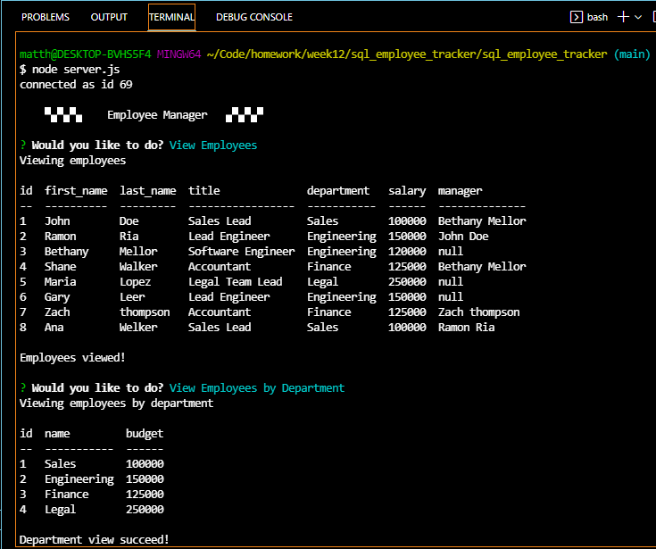

# Mysql Employee Tracker

Developers are frequently faced with building user interfaces that allow non-developers to see and interact with database information. These interfaces are frequently referred to as Content Management Systems. The goal of this homework assignment is to use node, inquirer, and MySQL to develop and create a solution for managing a company's personnel.

- [Live Link to Demo](https://youtu.be/LGKVsYj8NHU)

## Description
* Functional application
* The command-line application allows users to:

  * Add departments, roles, employees

  * View departments, roles, employees

  * Update employee roles

# Tech Used
- inquirer
- mySQL
- console.table
- Javascript
- Node.js

## Repository

  - [Project Repo](https://github.com/Matthewwalker333/sql_employee_tracker)

## Questions
*For any additional information find me at* 

GitHub: [@Matthewwalker333](https://github.com/Matthewwalker333/)

Email: [matthewwalkermw64@gmail.com](mailto:matthewwalkermw64@gmail.com)
